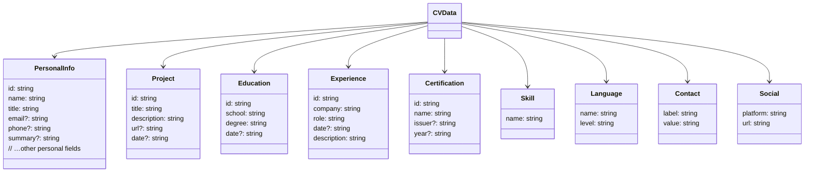

# 📄 PROJECT DOCUMENTATION – CV‑Editor

*This document is written for both **human developers** and **AI assistants** (e.g. the `pi` coding agent).  It gathers everything you need to understand, develop, test, lint, and extend the CV‑Editor repository.*

---

## 1️⃣  Overview

The repository implements a **single‑page web application** that lets users edit a curriculum‑vitae (CV) and preview it in several visual *themes* (Modern, Classic, Elegant, Hipster, etc.).

Key concepts:
- **Domain model** – Defined in `src/core/domain/*.ts` (e.g. `cv.types.ts`).  It describes `PersonalInfo`, `Project`, `Education`, `Experience`, `Certification`, `Skill`, …
- **Store** – A tiny Zustand store (`src/core/store/useCvStore.ts`) holds the mutable CV data.
- **Preview** – Theme components under `src/features/cv-preview/themes/` render the data.
- **Form** – Editable forms under `src/features/cv-form/components/` allow the user to manipulate the store.
- **Internationalisation (i18n)** – Translation JSON files live in `public/lang/<lang>/` and are accessed via `useTranslation("theme")` or `useTranslation("form")`.
- **Tailwind CSS** – All UI styling uses Tailwind utility classes; there is **no custom CSS**.
- **PDF generation** – `src/core/services/pdf/*` convert the preview into a PDF.

---

## 2️⃣  Prerequisites & Installation

| Tool | Version (tested) |
|------|------------------|
| **Node** | `>=20` |
| **npm** | `9.x` |
| **Git** | any recent version |
| **Tailwind CLI** – installed as a dev dependency |
| **Vite** – the build tool (bundled) |

```bash
# Clone the repository
git clone https://github.com/Dibeo/ClearCV
cd cv-editor

# Install dependencies (uses npm workspaces – plain `npm install` works)
npm ci   # or `npm install` if you prefer
```

---

## 3️⃣  Project Structure

```
📦 cv-editor
├─ 📁 public                 # static assets & i18n JSON files
│   └─ lang
│      ├─ en/theme.json      # theme translations (sections, labels…)
│      ├─ fr/form.json       # form translations (example)
│      └─ …
├─ 📁 src
│   ├─ 📁 core                # pure business logic & utils
│   │   ├─ 📁 domain           # TypeScript interfaces (cv.types.ts, cv.constants.ts)
│   │   ├─ 📁 store            # Zustand store (useCvStore.ts) + tests
│   │   ├─ 📁 services         # PDF generation, storage, migrations
│   │   └─ 📁 utils            # helpers (imageUtils, etc.)
│   ├─ 📁 features
│   │   ├─ 📁 cv-form          # Form components (FormProjects.tsx, FormSkills.tsx …)
│   │   └─ 📁 cv-preview
│   │       └─ 📁 themes       # Theme components (ModernTheme.tsx, ClassicTheme.tsx …)
│   ├─ 📁 App.tsx            # Root component (router, layout)
│   ├─ 📁 i18n.ts            # i18next bootstrap
│   └─ 📁 main.tsx           # Vite entry point
├─ 📁 tests                  # Additional integration tests (if any)
├─ 📄 vite.config.ts         # Vite configuration (Tailwind, alias @/…)
├─ 📄 tsconfig.json          # TypeScript compiler options
├─ 📄 eslint.config.js       # ESLint configuration (prettier, @typescript‑eslint)
├─ 📄 tailwind.config.js    # Tailwind configuration (custom colors, plugins)
└─ 📄 DOCUMENTATION.md       # ⇐ you are reading it!
```

---

## 4️⃣  Development Scripts (npm)

| Script | Description |
|--------|-------------|
| `npm run dev` | Starts Vite dev server (`http://localhost:5173`). |
| `npm run build` | Produces a production build in `dist/`. |
| `npm run test` | Runs unit tests with **Vitest** (no coverage). |
| `npm run test -- --coverage` | Runs tests and prints a coverage report. |
| `npm run lint` | Executes **ESLint** across the code base. |
| `npm run lint:fix` | Lint + auto‑fix (where possible). |
| `npm run format` | Runs **Prettier** (if configured). |

---

## 5️⃣  TypeScript Types & Data Model

The central source of truth is `src/core/domain/cv.types.ts`.  A typical `Project` now looks like:

```ts
export interface Project {
  id: string;
  title: string;          // displayed as the project name
  description: string;
  url?: string;           // optional external link
  date?: string;          // a single human‑readable date string (e.g. "2022‑01 — 2023‑03")
}
```

### Data Schema (Mermaid)

Below is a quick visual overview of the main data structures used throughout the app.  It is expressed in **Mermaid** syntax, which many Markdown renderers (including VS Code, GitHub, and GitLab) can display directly.



### Adding a New Field
1. **Update the interface** in `cv.types.ts`.
2. **Update constants** (`cv.constants.ts`) – add default values for seed data.
3. **Update the form** – edit the corresponding `Form…` component (e.g. `FormProjects.tsx`) to render an input and handle state updates.
4. **Update the preview** – modify the theme component(s) to display the new field.
5. **Run tests** – add a test case if the field influences logic.

---

## 6️⃣  Theme System (ModernTheme as Example)

Each theme is a functional React component that receives the **full CV data** via a `data` prop and a translation function `t` from `useTranslation("theme")`.

### Basic Skeleton (ModernTheme.tsx)
```tsx
import { useTranslation } from "react-i18next";
import { ContactType, SOCIAL_ICONS, CONTACT_ICONS } from "…"; // icons map

export const ModernTheme = ({ data }: { data: CVData }) => {
  const { t } = useTranslation("theme");
  // left column (contacts, skills, certifications, …)
  // right column (summary, experiences, projects, …)
};
```

#### Common Patterns
- **Section titles** – use `t("sections.<key>")`.
- **Lists** – map over `data.<array>`; keep the key unique (`id`).
- **Conditional rendering** – guard with `&& data.<array>.length > 0`.
- **Tailwind layout** – the left column is `w-[35%] bg-[#1e293b] …`, the right column `w-[65%] …`.
- **Icons** – `SOCIAL_ICONS` and `CONTACT_ICONS` provide a fallback to a generic icon.

#### Recent Change (mailto / tel links)
The contact value is now rendered automatically:
```tsx
{c.value ? (
  c.value.includes("@") ? (
    <a href={`mailto:${c.value}`} className="text-slate-200 underline">{c.value}</a>
  ) : /^[+\d][\d\s-]*$/.test(c.value.replace(/\s+/g, "")) ? (
    <a href={`tel:${c.value.replace(/\s+/g, "").replace(/-/g, "")}`} className="text-slate-200 underline">{c.value}</a>
  ) : (
    <p className="text-slate-200">{c.value}</p>
  )
) : (<p className="text-slate-200">—</p>)}}
```
*All other themes should follow the same pattern for consistency.*

### Adding a New Theme
1. Duplicate an existing theme file (e.g. `ModernTheme.tsx`).
2. Rename the component (`export const MyNewTheme = …`).
3. Adjust Tailwind classes as you wish – keep the same **layout contract** (left/right columns) so the rest of the app does not break.
4. Export the component from `src/features/cv-preview/themes/index.ts`.
5. Add a translation entry in `public/lang/<lang>/theme.json` under `sections.<your‑section>`.

---

## 7️⃣  Form Components (e.g. FormProjects)

Forms live under `src/features/cv-form/components/`.  They use the **store** directly (`useCvStore`) and contain helper functions for add / update / delete.

Typical structure:
```tsx
export const FormProjects = () => {
  const { data, setData } = useCvStore();
  const addProject = () => { /* push a new object with default values */ };
  const updateProject = (id, changes) => { /* map over data.projects */ };
  // UI → map over data.projects, render inputs bound to updateProject
};
```

**When you modify the data model** you must:
- Adjust the default object in `addProject`.
- Add or remove input fields.
- Ensure each input calls `updateProject` with the correct key.
- Keep the `key` prop on each rendered item stable (use `proj.id`).

---

## 8️⃣  Internationalisation (i18n)

The project uses **i18next** with JSON resources located in `public/lang/<code>/`.

- **Theme strings** → `public/lang/en/theme.json` (sections, labels, etc.)
- **Form strings** → `public/lang/en/form.json` (field placeholders, validation messages)

### Adding a New language
1. Copy the `en` folder to a new locale folder (e.g. `es`).
2. Translate every key‑value pair.
3. Update `src/i18n.ts` if you want to preload the language or set a fallback.

### Adding a New translation key
1. Insert the key/value in the appropriate JSON file.
2. Access it in code via `t("myKey")` after importing `useTranslation("theme")` or `useTranslation("form")`.
3. Run the dev server and verify the UI updates.

---

## 9️⃣  Styling with Tailwind CSS

All components use **utility‑first** Tailwind classes.  No custom CSS files are present.

- **Responsive design** – use Tailwind breakpoints (`md:`, `lg:`) as needed.
- **Consistent colors** – the theme uses the built‑in palette (`text‑blue‑400`, `bg‑slate‑800`, …).  To change a color globally, edit `tailwind.config.js`.
- **Spacing** – Prefer `gap-2`, `space-y-2`, etc.  The project historically uses **tab‑based indentation** (4 tabs per level).

### Example – Making a list “drawer‑like”
The recent change turned skill and certification badges into vertical stacks:
```tsx
<div className="flex flex-col space-y-2">
  {/* each item */}
</div>
```

---

## 🔟  PDF Generation

The PDF engine lives under `src/core/services/pdf/` and uses **html‑to‑pdf** (via `puppeteer` or a headless Chromium).  The entry point is `src/core/services/pdf/cv-pdf-engine.ts`.

Typical usage:
```ts
import { generatePdf } from "./cv-pdf-engine";
await generatePdf(cvData, { format: "A4", outputPath: "./cv.pdf" });
```
If you need to expose a new field in the PDF, simply add it to the React theme (the PDF generator renders the *same* component tree as the web preview).  No extra PDF‑specific code is necessary.

---

## 1️⃣1️⃣  Testing & Coverage

- **Vitest** is the test runner; tests are located next to the code they cover (e.g. `src/core/store/__tests__/useCvStore.test.ts`).
- Run `npm run test` for a fast feedback loop; `npm run test -- --coverage` for a coverage report.
- **Coverage thresholds** are not enforced in CI, but aim for > 80 % on critical modules (store, utils, services).
- To add a test:
  1. Create a `*.test.tsx` or `*.test.ts` file next to the module.
  2. Use Vitest’s `describe`, `it`, and `expect`.
  3. If the test needs DOM, use `@testing-library/react` (already a dev dependency).

---

## 1️⃣2️⃣  Linting & Formatting

- **ESLint** (`eslint.config.js`) enforces:
  - `@typescript-eslint` rules (no‑unused‑vars, explicit return types, etc.)
  - **Prettier** integration (ensures consistent spacing and line‑breaks).
- Run `npm run lint` to see problems; `npm run lint:fix` to auto‑fix where possible.
- **Tab‑based indentation** – the project uses tabs, not spaces.  The ESLint config includes `indent: ["error", "tab"]`.

---

## 1️⃣3️⃣  Adding / Updating Dependencies

1. **Install** – `npm install <package>` (or `npm i -D <package>` for dev deps).
2. **Commit** – after a change, run `npm audit` and address any vulnerabilities.
3. **Upgrade** – use `npm outdated` to see what can be bumped, then `npm install <package>@latest`.
4. **Pin versions** – the CI expects a lockfile (`package-lock.json`).  Do not manually edit it.

If a new dependency brings **new ESLint rules** or **TypeScript types**, remember to:
- Add the rule to `eslint.config.js` (if needed).
- Add the type package (`@types/…`) to `devDependencies`.
- Run `npm run lint` and fix any newly reported issues.

---

## 1️⃣4️⃣  Common Tasks & How‑to Guides

### 📧  Make a contact line clickable (mailto / tel)
The **ModernTheme** now detects the value automatically.  If you need the same behavior in another theme:
1. Locate the contact rendering block (usually `c.value`).
2. Replace the plain `<p>` with the conditional JSX shown in the **Recent Change** section.
3. Ensure the surrounding `<div className="text‑[10px] break‑all">` stays unchanged.

### 🛠️  Add a new **Project** field (e.g., `githubUrl`)
1. Extend `Project` in `cv.types.ts`:
   ```ts
   githubUrl?: string;
   ```
2. Update the seed data in `cv.constants.ts` with a sample URL.
3. In `FormProjects.tsx` – add an `<input>` bound to `proj.githubUrl` and call `updateProject(id, { githubUrl: newValue })`.
4. In each theme (`ModernTheme.tsx` etc.) – render the link where you want it, e.g.:
   ```tsx
   {proj.githubUrl && (
     <a href={proj.githubUrl} className="text‑blue‑500 underline" target="_blank">GitHub</a>
   )}
   ```
5. Run `npm run test` (add a test if the new field influences logic) and `npm run lint`.

### 🎨  Change the colour of the left‑sidebar accent line
Edit `ModernTheme.tsx` line 20 (or the equivalent in other themes):
```tsx
<div className="w-[35%] bg-[#1e293b] text-white p-8 flex flex-col gap-8 shadow-inner">
```
Replace the hex colour (`#1e293b`) with your desired Tailwind colour or a custom HEX.

---

## 1️⃣5️⃣  Contribution Guidelines

1. **Branch naming** – `feature/<short‑description>` or `bugfix/<issue‑id>`.
2. **Commit messages** – follow the conventional‑commits format (`feat: add …`, `fix: correct …`).
3. **Pull request template** – include sections for *What does this PR change?*, *How was it tested?*, *Screenshots (if UI)*.
4. **Run the full suite** (`npm run test && npm run lint`) before opening a PR.
5. **Documentation** – any new feature must be reflected in `DOCUMENTATION.md` (or a dedicated markdown file under `docs/`).

---

## 1️⃣6️⃣  How AI (pi) Can Help

- **Reading files** – `read({path:"src/.../file.ts"})`.
- **Editing in‑place** – use `edit` with exact `oldText` → `newText` pairs.
- **Creating new files** – `write({path:"src/new/file.ts", content:"…"})`.
- **Running commands** – `bash({command:"npm run lint"})`.
- **Testing** – `bash({command:"npm run test"})` to verify that a change didn’t break anything.
- **Fetching external docs** – `web_search` or `code_search` for library examples.
- **Delegating** – use the `pi‑subagents` skill to run a chain of tasks (e.g., “plan → implement → test”).

When you ask the assistant to modify code, always give the **file path** and a concise description of the required change.  The assistant will read the file, apply the edit, and run the test suite to ensure nothing is broken.

---

## 🎉  Final Note

This repository is deliberately **small, opinionated, and self‑contained**.  The goal is to keep the developer experience fast: a single `npm install`, a single `npm run dev`, and a tight feedback loop with tests and linting.

If you encounter an issue that isn’t covered here, feel free to open an issue on the repository or ask the AI assistant for a “quick‑look” – it can read the relevant file, propose a diff, and apply it automatically.

---